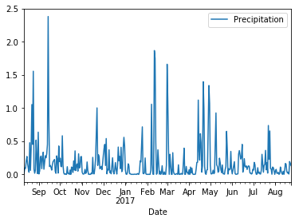
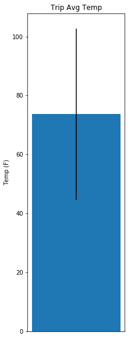
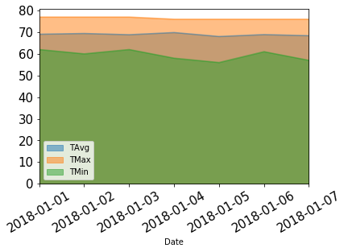

```python
# Dependencies
import sqlalchemy
from sqlalchemy import create_engine, MetaData
from sqlalchemy.ext.automap import automap_base
from sqlalchemy.orm import Session
from sqlalchemy.ext.declarative import declarative_base
from sqlalchemy import Column, Integer, String, Numeric, Text, Float, Date
import pandas as pd
import numpy as np
from datetime import datetime
import seaborn as sns
```


```python
#Create Engine
engine = create_engine("sqlite:///hawaii.sqlite",echo=False)
conn = engine.connect()
```


```python
#automap
Base=automap_base()
Base.prepare(engine, reflect=True)
Base.classes.keys()
```


    ['measurements', 'stations']


```python
Measurement=Base.classes.measurements
Station=Base.classes.stations
```


```python
session=Session(engine)
```

# Precipitation Analysis


```python
lastyear=session.query(Measurement.date, Measurement.prcp).filter(Measurement.date>'2016-08-10').all()
```


```python
dates=[datetime.strptime(data.date,'%Y-%m-%d') for data in lastyear]
prcp=[data.prcp for data in lastyear]
a=pd.DataFrame({'Date':dates,"Precipitation":prcp}).set_index('Date')
```


```python
#Plot Results
import matplotlib.pyplot as plt
a.groupby('Date').mean().plot()
plt.show()
```





```python
#Summary Statistics
a.describe()
```


<div>
<style>
    .dataframe thead tr:only-child th {
        text-align: right;
    }

    .dataframe thead th {
        text-align: left;
    }

    .dataframe tbody tr th {
        vertical-align: top;
    }
</style>
<table border="1" class="dataframe">
  <thead>
    <tr style="text-align: right;">
      <th></th>
      <th>Precipitation</th>
    </tr>
  </thead>
  <tbody>
    <tr>
      <th>count</th>
      <td>2092.000000</td>
    </tr>
    <tr>
      <th>mean</th>
      <td>0.178905</td>
    </tr>
    <tr>
      <th>std</th>
      <td>0.460854</td>
    </tr>
    <tr>
      <th>min</th>
      <td>0.000000</td>
    </tr>
    <tr>
      <th>25%</th>
      <td>0.000000</td>
    </tr>
    <tr>
      <th>50%</th>
      <td>0.020000</td>
    </tr>
    <tr>
      <th>75%</th>
      <td>0.130000</td>
    </tr>
    <tr>
      <th>max</th>
      <td>6.700000</td>
    </tr>
  </tbody>
</table>
</div>


# Station Analysis


```python
#Total Number of Stations
conn.execute("select count(Station) from stations").fetchall()
```


    [(9,)]


```python
#Most Active Stations by descending Order
conn.execute("select station,count(station) from measurements group by station order by count(station) desc").fetchall()
```


    [('USC00519281', 2772),
     ('USC00513117', 2696),
     ('USC00519397', 2685),
     ('USC00519523', 2572),
     ('USC00516128', 2484),
     ('USC00514830', 1937),
     ('USC00511918', 1932),
     ('USC00517948', 683),
     ('USC00518838', 342)]


```python
#Last 12 months of temperature observation data from most active station
data=conn.execute("select tobs from measurements where station = 'USC00519281' and date>'2016-08-10'").fetchall()
data=[i[0] for i in data]
num_bins=12
n, bins, patches = plt.hist(data, num_bins, facecolor='blue', alpha=.5)
plt.show()
```


# Temperature Analysis


```python
def calc_temps(start,end):
    minimum= conn.execute(f"select min(tobs) from measurements where date>={start} and date <={end}").fetchall()[0][0]
    maximum=conn.execute(f"select max(tobs) from measurements where date>={start} and date <={end}").fetchall()[0][0]
    sumation,total=conn.execute(f"select sum(tobs),count(tobs) from measurements where date>={start} and date <={end}").fetchall()[0]
    average=sumation/total
    return minimum, average, maximum
```


```python
minimum, average, maximum=calc_temps('2017-01-01','2018-01-01')
```


```python
plt.figure(figsize=(3,10))
plt.axes().get_xaxis().set_visible(False)
plt.bar(0,average,.5,align='center',yerr=maximum-minimum)
plt.title('Trip Avg Temp')
plt.ylabel('Temp (F)')
plt.show()
```





# Rainfall per Weather Station


```python
conn.execute("select station,sum(prcp) from measurements where date>'2016-08-10' group by station").fetchall()

```


    [('USC00513117', 50.47000000000003),
     ('USC00514830', 33.46),
     ('USC00516128', 156.53000000000003),
     ('USC00517948', 4.59),
     ('USC00519281', 73.74000000000001),
     ('USC00519397', 16.64999999999999),
     ('USC00519523', 38.830000000000005)]


# Daily Normals


```python
def daily_normals(date):
    minimum=conn.execute(f"select min(tobs) from measurements where date like '20%%-{date}' ").fetchall()[0][0]
    maximum=conn.execute(f"select max(tobs) from measurements where date like '20%%-{date}' ").fetchall()[0][0]
    sumation,count=conn.execute(f"select sum(tobs),count(tobs) from measurements where date like '20%%-{date}' ").fetchall()[0]
    average=sumation/count
    return minimum,average,maximum
```


```python
listofdates=['01-01','01-02','01-03','01-04','01-05','01-06','01-07']
dates=['2018-'+i for i in listofdates]
```


```python
mins=[]
avgs=[]
maxs=[]
for i in listofdates:
    a,b,c=daily_normals(i)
    mins.append(a)
    avgs.append(b)
    maxs.append(c)
```


```python
a=pd.DataFrame({"Date":dates,"TMin":mins,"TAvg":avgs,"TMax":maxs})
```


```python
a.set_index("Date")
```


<div>
<style>
    .dataframe thead tr:only-child th {
        text-align: right;
    }

    .dataframe thead th {
        text-align: left;
    }

    .dataframe tbody tr th {
        vertical-align: top;
    }
</style>
<table border="1" class="dataframe">
  <thead>
    <tr style="text-align: right;">
      <th></th>
      <th>TAvg</th>
      <th>TMax</th>
      <th>TMin</th>
    </tr>
    <tr>
      <th>Date</th>
      <th></th>
      <th></th>
      <th></th>
    </tr>
  </thead>
  <tbody>
    <tr>
      <th>2018-01-01</th>
      <td>69.060000</td>
      <td>77</td>
      <td>62</td>
    </tr>
    <tr>
      <th>2018-01-02</th>
      <td>69.408163</td>
      <td>77</td>
      <td>60</td>
    </tr>
    <tr>
      <th>2018-01-03</th>
      <td>68.833333</td>
      <td>77</td>
      <td>62</td>
    </tr>
    <tr>
      <th>2018-01-04</th>
      <td>69.836364</td>
      <td>76</td>
      <td>58</td>
    </tr>
    <tr>
      <th>2018-01-05</th>
      <td>68.000000</td>
      <td>76</td>
      <td>56</td>
    </tr>
    <tr>
      <th>2018-01-06</th>
      <td>68.886792</td>
      <td>76</td>
      <td>61</td>
    </tr>
    <tr>
      <th>2018-01-07</th>
      <td>68.381818</td>
      <td>76</td>
      <td>57</td>
    </tr>
  </tbody>
</table>
</div>


```python
a.plot.area(x=a.Date,alpha=.5,rot=30,fontsize=15,stacked=False)
plt.show()
```




